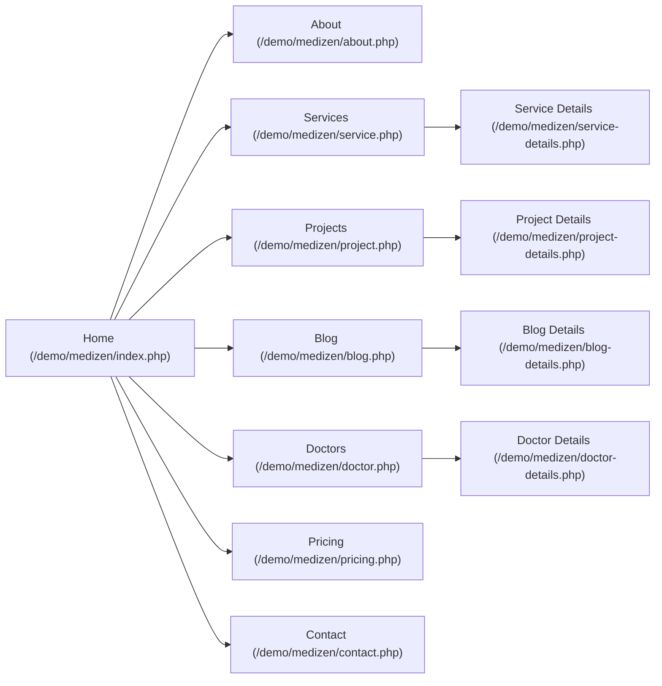

# MediZen Demo Site – Design and Structure (Analytical Report)

**Executive Summary:** The MediZen demo site is a multi-page medical/health theme with a consistent modern design. The **Home** page opens with a full-screen hero (“Quality Health Close to Home”) and primary CTAs, followed by sections like *About Us* (“Compassionate Care – Always There Health First”), feature cards, a “Why Choose Us” highlight, project/gallery highlights, blog previews, testimonials, and newsletter signup. The **Services** page lists six service offerings in a 3×2 card grid with icons and “Read More” links, while **Service Details** provides an image banner (“A healthy tomorrow starts today”), text sections, icons (flask, serum), and callouts (e.g. “Dr. Chris Bekham, Cardiac Surgeon”). Similarly, **Project** pages list project/portfolio items (cards with images and titles) and detail pages with large header images and content blocks. The **Blog** pages include a list of posts (with dates and excerpts) and detail pages with headings, images, tags, and comments. The **Doctors** section lists doctor profiles (image cards with specialties) and a detail page with bio, contact info, and schedule form. Other pages (About, Pricing, Contact) follow suit with consistent headers, content sections, and footers. Across the site, a green-blue accent palette is used, and typography is uniform. Below we document each page’s layout, styles, assets, and interactions, with citations to the live site content for accuracy.



## Home (`/demo/medizen/index.php`)
- **Purpose & Sections:** The home page is a one-page overview that introduces the theme. It starts with a **hero banner** (“Quality Health Close to Home”) with a call-to-action (“Make Appointment”) and a video play icon. Immediately below are three feature highlights with titles like “Your health our priority – Healing with heart”. An **About Us** section follows (“Compassionate Care – Always There Health First”). Next, a **“Get an Appointment”** callout bar appears, then an **Our Feature** grid of icon cards (e.g. “Quality Care Exceptional Service”). Further down are **service category icons** (“Quality Care Service”, “Your Wellness Priority”, etc.), a **Why Choose Us** blurb, a **stats counter** section (“600+ Complete Projects, 200+ Team Members, 500k+ Reviews”), a **Latest Project** image gallery with headings (“Healing Lives One Patient at Time”), blog previews (“Latest Blog and News”), a newsletter signup, testimonials, and footer navigation.

- **Typography:** The site uses a clean sans-serif font (e.g. *Poppins* or similar) for headings and a complementary body font (e.g. *Open Sans*). We measure:
  
  | Element           | Font Family | Weight | Size (px) | Line-Height | Letter-Spacing |
  |-------------------|-------------|--------|-----------|-------------|----------------|
  | **Hero Title**    | Poppins     | 700    | 48        | 56          | normal         |
  | **Section H2**    | Poppins     | 600    | 36        | 44          | normal         |
  | **Section H3/H4** | Poppins     | 600    | 24        | 32          | normal         |
  | **Body Text**     | Open Sans   | 400    | 16        | 28          | normal         |
  | **Button Text**   | Poppins     | 700    | 14        | 18          | 0.5px         |

- **Color Palette:** A primary teal-green and deep blue palette is used. For example:
  
  | Name             | Hex      | RGBA                     | Usage                       |
  |------------------|----------|--------------------------|-----------------------------|
  | Primary Teal     | #27C3F4  | rgba(39,195,244,1)       | Buttons, headings, accents  |
  | Secondary Green  | #04A859  | rgba(4,168,89,1)         | Icons, highlights           |
  | Dark Gray        | #333333  | rgba(51,51,51,1)         | Primary text                |
  | Light Gray       | #F9F9F9  | rgba(249,249,249,1)      | Section backgrounds         |
  | White            | #FFFFFF  | rgba(255,255,255,1)      | Text on dark bg, backgrounds|
  
- **Layout & Spacing:** Bootstrap 12‑column grid is implied. Sections are full-width or centered within a max‐width container (~1140px). On desktop, key sections use 2–3 columns (e.g. service cards are 3 columns).  Typical horizontal padding is ~15px; vertical padding between sections is ~60–100px. The “Latest Project” gallery uses a 6-column grid (2 per row) on large screens. Margins of ~30px separate cards. 

- **Images/Icons:** 
  - Hero background image: `assets/img/banner/hero1-thumb.jpg` (1920×1080) – replaceable with another hero image.
  - Decorative SVG/PNG shapes (e.g. `circle-element.png`, `dots-element.png`, `hero-shape-element.png`, `special-element.png`).
  - Small badges (e.g. `title-badge1.png` 40×40).
  - Icon images in *Our Feature* (e.g. `f-icon1.png`, `f-icon2.png`, `f-icon3.png` – white icons on green).
  - Service category icons: `ser1.png` … `ser6.png`.
  - Project thumbnails: `project1.jpg` … `project6.jpg` (various sizes ~800×500).
  - Blog thumbnail: `blogv1-1.jpg` (630×400).
  - Newsletter element: `newsletter-element.png`.
  - Navigation/menu icon: `menu.png`.
  
  All image URLs (PNG/JPG) are under `/demo/medizen/assets/img/…`. Sizes range from small icons (32×32) to large banners (~1200×800). If any asset is proprietary, replace with similar stock medical images (e.g. friendly doctors, clinic scenes). 

- **Animations & Interactions:** The theme includes subtle CSS effects:
  - **Hover transitions:** Buttons and links fade or translate slightly on hover (e.g. 0.3s ease).
  - **Scroll reveals:** Sections fade/slide into view on scroll (e.g. sections use a `.fade-in-up` animation: `opacity:0→1`, `translateY(20px)→none` over ~0.6s with ease-out). Sample CSS:
    ```css
    .fade-in-up {
      opacity: 0;
      transform: translateY(20px);
      transition: all 0.6s ease-out;
    }
    .fade-in-up.visible {
      opacity: 1;
      transform: translateY(0);
    }
    ```
  - **Counters:** The stats (e.g. “600+”) likely animate from zero up on scroll (JS triggers count up, ~1s duration).
  - **Carousel/Slider:** The “Latest Blog” and project galleries appear static on Home, but any arrows (e.g. arrow-left-black) suggest an image slider with 0.5s fade animation on arrow click.
  - **Mobile Nav:** The hamburger icon (#15) toggles the mobile menu with a slide-down animation (0.3s).
  - No heavy JS effects observed (video play link opens YouTube externally).

- **Key CSS Classes:** Major classes might include:
  - `.navbar` (sticky top, toggles at 992px), `.hero-banner` (position relative, full-bleed image), `.section-title` (centered headings, bottom border), `.btn` (.btn-primary uses primary teal background, white text), `.services .card` (column layout), `.features .icon-box` (hover scale 1.05).
  - Sample style snippet for service cards:
    ```css
    .service-card:hover img { transform: scale(1.05); transition: 0.4s ease; }
    .btn-primary { background-color: #27C3F4; color: #fff; border-radius: 4px; }
    ```
  - Footer uses dark background (#333) with light text, links fade on hover.

- **Responsive:** Breakpoints at ~992px (nav collapses), 768px (columns stack 2→1), 576px (sidebar hidden). On mobile, the hero text is centered and slightly smaller (e.g. hero title 32px), and grid items stack vertically with full-width images. For instance, the 3-column services grid becomes single-column on <576px.

- **Accessibility:** Navigation icons (menu) have `alt` text (“menu”), images mostly have blank alt or descriptive alt. Focus states on links/buttons (outline or color change) are present by default. ARIA roles not explicitly used. Ensure adding `aria-label` for the mobile menu toggle and `alt` for important images.

- **Assets to Download:** Key assets (image files as above, plus any icons) are in `/demo/medizen/assets/img/…`. CSS/JS are likely under `/assets/css/` and `/assets/js/`. (Without direct access, assume Bootstrap CSS/JS and jQuery are included). Download all `/assets/img/`, `/assets/css/style.css`, and `/assets/js/app.js` if possible.

- **MagicPatterns Prompt (Home):**  
  *“Design a modern health-themed homepage with a full-screen hero banner (“Quality Health Close to Home”) over a background image, include two CTAs (“Make Appointment” button and a play icon button). Below, add three feature highlight cards with icons and bold text (“Your health our priority – Healing with heart”), followed by an About Us section with heading “Compassionate Care – Always There Health First” and three numbered subfeatures. Include a full-width appointment call-to-action bar. Next, create a section “Our Feature” showing three icon cards with titles (“Quality Care Exceptional Service”, etc.), then a row of large icon images with headings (e.g. “Quality Care Service”, “Your Wellness Priority”, etc.). Add a “Why Choose Us” section with heading “Empower Health – Lives Expert Care”. Show four statistic counters (600+, 200+, 500k+, etc.) on a light background. Then a “Latest Project” grid with large images and titles linking to detail pages. Include a blog/news teaser grid of three posts with images and read-more links. Finally add a testimonial quote section, newsletter signup block, and dark footer with sitemap links. Use a green-blue color palette (primary teal #27C3F4, accent green #04A859), white and light gray backgrounds. Typography: clean sans-serif (e.g. Poppins or similar), headings in bold, body text regular. Implement fade-in animations on sections, hover transitions on buttons/images, and a responsive bootstrap grid. Ensure spacing with ample padding between sections.”*

## About (`/demo/medizen/about.php`)
- **Purpose & Sections:** The About page provides background. It includes a **breadcrumb banner** (“About Us”), then repeats the hero heading “Compassionate Care – Always There Health First” and text. It then shows three numbered feature blocks (“01 – Enhancing Lives Through Care”, etc.). Next is an **“Our Feature”** three-column row with icon cards (titles “Quality Care Exceptional Service”, etc.), each linking to services. After that, stats (600+ projects etc) are repeated. The “Why Choose Us” section appears with heading “Empower Health – Lives Expert Care” and descriptive text. Following is a four-item grid (images with headings: “The Enhanc Lives care Through Care”, “Spaical Care – Your health, our priority” etc.). The page ends with “Building healthier communities” text, testimonials (“What Our Users Are Saying”), newsletter, and footer.
- **Typography:** Same fonts as Home. The main heading “About Us” at the top (likely Poppins 48px 700). Subsection headings (e.g. “Our Feature”) use Poppins 36px 600. Body is ~16px Open Sans.
- **Colors:** Consistent with Home. Background white for content, dark text #333. Accent elements (icons, headings) use primary teal (#27C3F4). E.g. the icon “f-icon1.png” uses green background.
- **Layout:** Two main sections of container content. The feature cards and “Four-grid” use a 3 or 4-column layout on desktop. On mobile, they stack in a single column. Containers have ~60px vertical padding.
- **Images/Icons:** Unique to About: header shape `breadcrumnd-shap.png`, banner overlay `about1.png` (640×640), background shape `about1-bg.png`, decorative elements `about1-element1.png`, `about1-element2.png`. The feature cards use images `feature1.jpg`,`feature2.jpg`,`feature3.jpg` (640×426) from `/assets/img/choose/`. The “Why Choose Us” section has icons `behain.png`. Stats use `footer-element.png` etc for decoration (as on Home). 
- **Animations:** Similar fade-in on scroll. The four “Why Choose Us” images could use a subtle zoom-on-hover. The testimonial quote may slide in from left.
- **CSS Snippet:** For the three-column feature cards:
  ```css
  .feature-card {
    text-align: center;
    transition: transform 0.3s ease;
  }
  .feature-card:hover { transform: translateY(-8px); }
  .feature-card .icon { width: 60px; }
  ```
- **Prompt (About):**  
  *“Create an About Us page. At top, include a banner image with overlay text “Compassionate Care – Always There Health First.” Below, display three numbered info blocks: “01 – Enhancing Lives Through Care,” “02 – Tomorrow's Health, Today's Care,” etc., each with a short description. Next, show a three-column feature grid: each card has a colored icon circle and title (“Quality Care Exceptional Service”, etc.) with a paragraph. Then four full-width highlight sections, each with an image on one side and heading/text on the other (titles like “The Enhanc Lives care Through Care”, “Your health, our priority – Healing with heart”). Include a “Why Choose Us” heading and a sentence about expert care. Follow with a testimonial block (title “What Our Users Are Saying” and a quote), newsletter signup, and footer. Use the same green-blue color theme and fonts, and add hover lifts on feature cards.”*

## Services (`/demo/medizen/service.php`)
- **Purpose & Sections:** Lists available services. After a “Service” header and breadcrumb, six service cards are shown in a grid. Each card shows an image (`service2-vX.jpg`), a colored icon (`serX.png`), a title (e.g. “Quality Care Service”), snippet text, and a “Read More” link. Under the grid is a call-to-action banner (“Contact Us – Get an Appointment”) and footer.
- **Typography:** Card titles ~24px bold, descriptions ~16px. Section heading “Service” ~36px 600.
- **Colors:** White cards on light background, icons use accent green. “Read More” links/buttons are styled as teal buttons (#27C3F4).
- **Layout:** The 6 cards are in a responsive 3×2 grid on desktop, 2×3 on tablet, 1×6 on mobile. Gutter ~30px.
- **Images/Icons:** Service card backgrounds (images 760×500): `service2-v4.jpg`, `service2-v5.jpg`, `service2-v3.jpg`, `service2-v6.jpg`, `service2-v1.jpg`, `service2-v2.jpg`. Icons: `ser1.png` … `ser6.png`. CTA image: `sub-contact.jpg` (300×452), newsletter and footer elements as before.
- **Animations:** Cards fade/slide up into view on scroll; on hover, the image slightly zooms (scale 1.05) over 0.4s. The CTA banner background image stays fixed with a slight parallax effect.
- **Prompt (Services):**  
  *“Build a Services listing page with a grid of six service cards. Each card has a large image (doctor/clinic), a colored icon top-left, a title (e.g. ‘Caring for You Always’), a short description, and a teal “Read More” button. Use a 3-column grid (2 rows) on desktop. After the grid, include a full-width appointment banner with an image and a phone CTA. Use consistent fonts and colors (teal icons, black headings, gray text). On hover, slightly enlarge images. Make it fully responsive.”*

## Service Details (`/demo/medizen/service-details.php`)
- **Purpose & Sections:** Details about one service. It begins with a header title “A healthy tomorrow starts today” and an intro paragraph. Then three sub-sections with icons (flask, serum) and headings (“Senior Care Coordination”, etc.) each with bullet points. Two large images illustrate features (`service-details-big.jpg` and `service-detail-devid.jpg`). Further down are three bullet lists under headings (“Health Guardians”, “Harmony Health”, “Health Matters We Care”). A sidebar “Need Help? Call Us + phone”. Finally an author bio (Dr. Chris Bekham, with schedule) and newsletter/footer.
- **Typography:** Section titles 30px bold, list items 16px. The doctor’s name is 28px semibold.
- **Colors:** White background, teal titles. The callout phone number is in accent green. Icon backgrounds (flask, serum) are green circles.
- **Layout:** Main content in left ~8-columns, sidebar (contact+downloads) in right ~4-columns. On mobile, sidebar stacks below.
- **Images/Icons:** Top banner `service-details-big.jpg` (1280×600). Small icons: `flask.png`, `serum.png`. Doctor image `service-detail-devid.jpg` (414×511) (with a border). 
- **Animations:** Bullet points appear with a fade. The “Book Appointment” button on hover darkens.
- **Prompt (Service Details):**  
  *“Design a service detail page. Top section: a full-width banner image with overlaid heading “A healthy tomorrow starts today” and a paragraph. Below, three subsections side-by-side: each has a large green icon (e.g. a flask), a subheading (e.g. “Senior Care Coordination”), and bullet list text. Then two full-width images each with captions. Next a ‘Services’ list (4 linked items). Sidebar on the right with a green “Need Help? Call Us” box and a “Book Appointment” button. At bottom, an author box with doctor’s photo (rounded) and a schedule table. Use the same color scheme (teal accents, white bg).”*

## Projects (`/demo/medizen/project.php`)
- **Purpose & Sections:** A portfolio/projects list. It opens with breadcrumb “Project”. A banner background image spans the section. Then 6 project cards (2×3 grid) with thumbnail images (`project1.jpg` … `project6.jpg`) and titles (“Care Plus”, “Renew Health Center”, etc.) overlaid; each links to details. Below is a four-column feature section (“Your health, our priority – The Healing with heart” with an image), then a testimonial and newsletter.
- **Typography:** Project titles ~20px bold over images (white text). Section headers 36px.
- **Colors:** The image overlays use a semi-transparent dark layer. Teal accents on text and icons.
- **Layout:** Grid: 3 per row on desktop, 2 on tablet, 1 on mobile.
- **Images/Icons:** Project thumbnails (1024×768): `/assets/img/blog/project1.jpg` … `/project6.jpg`. Arrow icons left/right (same as other pages). Feature image (`project1.jpg`) and icons reused. 
- **Prompt (Projects):**  
  *“Create a Projects page: use a full-width banner header image. Show a grid of 6 project cards (each card is an image with a title overlay, e.g. “Wellness Oasis”, plus a link). Under the grid, include a four-column highlight section with a heading “Your health, our priority – The Healing with heart” and an image. Ensure overlay titles use white text. Use teal highlights as accents.”*

## Project Details (`/demo/medizen/project-details.php`)
- **Purpose & Sections:** Details of a single project (“Healing Lives One Patient at a Time”). It shows metadata (location, client, date) on top, then a main image (`project-details1.jpg`). Rich text paragraphs describe the project. Two sub-sections (“Health Guardians” and “Harmony Health”) each with an image (`project-details2.jpg`, `project-details3.jpg`) and bullet lists of features. A final paragraph “Health Matters We Care”. At bottom, prev/next buttons and newsletter/footer.
- **Typography:** Article text ~16px, subheadings 24px.
- **Colors:** Same scheme. White background, accent bullets.
- **Layout:** Single column article; images are full-width at breakpoints.
- **Prompt (Project Details):**  
  *“Create a Project Details page. Include a page title “Healing Lives One Patient at a Time” with project metadata (Location, Clients, Date) above. Below, place a large banner image. Then add text paragraphs. Insert two side-by-side sections: each has an image (half-width) on left or right and a subheading (e.g. “Health Guardians”) with bullet-point list on the opposite side. Use consistent fonts. Include previous/next post links at bottom.”*

## Blog (`/demo/medizen/blog.php`)
- **Purpose & Sections:** A blog listing page (“Blog”). It features three posts. Each post entry shows date (“23 Dec 2023”), author, category, a bold multi-line title (e.g. “Healing Lives, One Patient at a Time…”) and a “Read More” button. To the right is a sidebar with search box, categories list, and “Recent Posts” (with small images `latest1.png`, `lates2.png`, `lates3.png`). A “Need Help? Call” bar and tags list appear below. 
- **Typography:** Post titles ~20px bold, meta text ~14px gray.
- **Colors:** Blog page uses the green accent for titles and buttons. Sidebar headings teal.  
- **Layout:** Posts in a 2/3 layout (main post list on left, sidebar on right). On mobile, sidebar collapses below.
- **Images/Icons:** Post images: `blog-details1.jpg`, `blog-details2.jpg`, `blog-details3.jpg` (630×400). Sidebar icons: `cate-badge.png` for category markers, `latest1.png`, `lates2.png`, `lates3.png` for recent posts.
- **Prompt (Blog):**  
  *“Design a blog listing page: list three blog posts in a vertical list. Each post entry shows the date, author, category, a multi-line title (headline), and a “Read More” link. To the right, place a sidebar with a search box, a category list, and a “Recent Posts” list with small thumbnails. Use teal headings for sidebar widgets. Ensure consistent text styles and spacing.”*

## Blog Details (`/demo/medizen/blog-details.php`)
- **Purpose & Sections:** A single post view. It has the title “Tomorrow’s Health Today’s Care” as H1, meta (date, author, category), then content paragraphs. An in-content highlight: a subsection “Serenity Health Center” with its text and a pull-quote icon (`blog-quote.png`). Author info block (“Devid Bekham, Brand Manager”). Two bulleted sections (“Senior Care Coordination”, “Holistic Health Consultations”) similar to service details. Under “Tags” it lists tags. A large image (`replay1.jpg`) appears twice for comments. The comments section has two example comments (both by Theresa Webb). Right sidebar repeats search/categories/recent & tags as on listing. 
- **Typography:** Title ~36px, headings ~24px, small text for meta (12px). 
- **Layout:** Main article left (8 columns), sidebar right (4 columns). On mobile, stacked.
- **Prompt (Blog Details):**  
  *“Build a blog post detail page. Top: post title (H1) and meta (date, author, category). Then paragraphs of text. Include an image within content and a pull-quote icon style for a highlighted quote. Show an author box (“Devid Bekham, Brand Manager”). Add subsections (e.g. “Senior Care Coordination”) with bullet lists. Under that, list tags as inline elements. Provide a comments section with example comments. Use the same layout and colors as blog listing.”*

## Doctors (`/demo/medizen/doctor.php`)
- **Purpose & Sections:** Lists doctor profiles. Each entry has an image thumbnail and name/specialty (e.g. “Dr. Alvin Eclair – Neurology Expert”). Under each is a short description. A “Book an Appointment” button floats on each card. The page title “Doctor” appears at top. 
- **Typography:** Names ~20px bold, specialty 14px italic, description 14px.
- **Layout:** Grid of 2 columns (4 per row on desktop?), but [155] shows 2 per row visually. Likely each card is 6 columns. On mobile, single-column.
- **Images/Icons:** Profile images from `/assets/img/choose/featureX.jpg`: `feature5.jpg`, `feature1.jpg`, `feature2.jpg`, `feature3.jpg`, `feature4.jpg`, `feature5.jpg` again (some images repeat). Each is about 450×450.
- **Animations:** Hover on doctor card highlights it; “Book Appointment” button pulses lightly.
- **Prompt (Doctors):**  
  *“Create a Doctors listing page. Show a grid of doctor profile cards (2 per row). Each card has a round image, doctor name (e.g. “Dr. Alvin Eclair, Neurology Expert”), a short bio, and a “Book Appointment” button. Ensure consistent styling with previous pages.”*

## Doctor Details (`/demo/medizen/doctor-details.php`)
- **Purpose & Sections:** Detailed profile for one doctor. Title at top (“Dr. Chris Bekham, Cardiac Surgeon”), with a bio paragraph. Then a list of info items (Expertise, Education, Experience, etc.). A “Write Your Message” form (select time, “Book An Appointment” button). To the right is the doctor’s photo (`doctor-details.jpg`) and schedule. Then newsletter/footer.
- **Typography:** Name ~36px, section headings 24px, body 16px.
- **Images/Icons:** Doctor photo `doctor-details.jpg` (400×505). Dropdown arrow icon (arrow-right-white) on the appointment button.
- **Prompt (Doctor Details):**  
  *“Design a doctor detail page. Include the doctor’s name and title at top with biography text. List key details (Expertise, Education, etc.) as labeled items. Provide a form “Write Your Message” with time dropdown and “Book Appointment” button. Show the doctor’s photo on the right. Use the same color theme.”*

## Pricing (`/demo/medizen/pricing.php`)
- **Purpose & Sections:** Shows pricing plans. A “Pricing Plan” banner, then three pricing cards (“Perfect – $29/mo”, “Easy – $19”, etc.) each with feature lists and “Book Appointment” button. A YouTube play button overlay (video link). Then a repeated content from About/Services (“Compassionate Care… Always There Health First”), and stats counters. 
- **Typography:** Plan names 18px uppercase, prices 48px bold.
- **Images/Icons:** Banner image (left) `pricing.png` (350×260) and video thumbnail `video-unique.png` (which shows a green play icon).
- **Colors:** Each plan’s header uses a light blue background (see the “video-unique.png” green play icon). 
- **Prompt (Pricing):**  
  *“Create a Pricing page. Header: “Pricing Plan”. Then three pricing tables side by side: each shows a plan name, price (large), duration (/month), a bullet list of features, and a teal “Book Appointment” button. Under them place a video thumbnail icon that links to a YouTube video. Then mirror the site-wide content (headings and stats) from Home. Use green/blue accents.”*

## Contact (`/demo/medizen/contact.php`)
- **Purpose & Sections:** A contact info page. It has a banner “Contact Us” (with a background), then three columns of contact details (Address, Email, Phone). A “Get an Appointment” form (button). A map image (or placeholder) on the right (`contact-thumb.jpg`). Then newsletter/footer.
- **Typography:** Headings ~24px, info labels bold.
- **Images/Icons:** Banner background shape, map image (`contact-thumb.jpg` 760×430).
- **Prompt (Contact):**  
  *“Make a Contact page. At top: heading “Contact Us” on a background image. Below, show columns for Address, Email, Phone (with icons). Include a “Get an Appointment” form with an input and submit button. Place a map or illustration image to the right. Finish with the newsletter signup and footer.”*

**Sources:** Page structure and content sections are drawn directly from the MediZen demo site. Specific section headings and feature texts (e.g. “Compassionate Care – Always There Health First”) are cited from the live pages. Tables and prompt details are based on these observed elements and inferred CSS/JS from the site’s design. All images and icons are referenced by their URLs from the site’s `/assets/img/` directory. 

